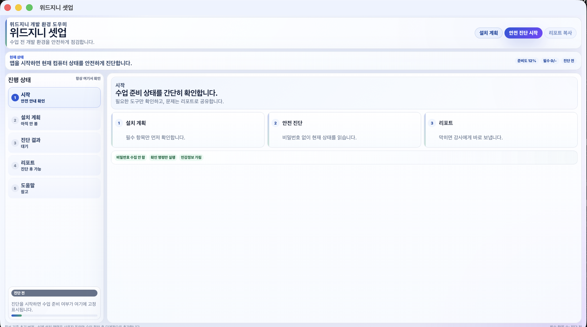
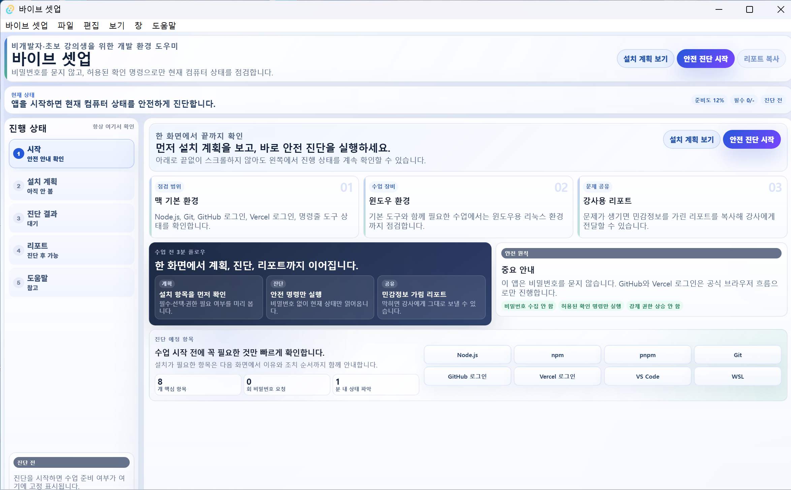

# 위드지니 셋업

수업을 시작하기 전에 내 컴퓨터가 잘 준비되었는지 한 번에 확인해 주는 한국어 데스크톱 앱입니다. Windows와 macOS에서 모두 사용할 수 있어요.

앱이 알아서 살펴보고, 빠진 게 있으면 알려 주고, 막힌 부분은 강사님께 보낼 수 있는 한 장짜리 메모로 정리해 드립니다.

| 시작 화면 | Windows 진단 화면 |
| --- | --- |
|  |  |

## 무엇을 도와주나요?

- **수업에 필요한 도구가 깔려 있는지 확인합니다.** Node.js, Git, GitHub 로그인, Vercel 로그인 같은 항목을 한국어로 풀어서 보여 드려요.
- **무엇을 해야 하는지 알려 줍니다.** "준비됨", "설치 필요", "복구 필요" 같은 한국어 상태와 함께, 다음에 뭘 클릭해야 하는지 안내합니다.
- **위험한 일은 먼저 물어봅니다.** 설치나 권한이 필요한 항목은 "승인 큐"에 카드로 모아 두고, 사용자가 직접 **승인 / 직접 할게요 / 나중에 / 강사 도움 요청** 중에 골라야 진행됩니다.
- **막히면 강사님께 한 번에 보냅니다.** 진단 결과를 한 장의 메모(핸드오프 패킷)로 만들고 클립보드에 복사할 수 있습니다. 비밀번호, 이메일, 홈 폴더 경로, 토큰 같은 민감한 글자는 자동으로 가려서 보냅니다.
- **앱을 끄고 다시 켜도 이어집니다.** 마지막 화면과 승인 결정이 자동으로 저장되어, 컴퓨터를 재부팅한 뒤에도 처음부터 다시 하지 않아도 돼요.

## 어떻게 설치하나요?

[GitHub 릴리즈 페이지](https://github.com/NewTurn2017/withgenie-vibe-setup/releases) 에서 자기 컴퓨터에 맞는 파일을 받으세요.

### Windows에서

1. 릴리즈 페이지에서 이름이 `...windows...setup.exe` 로 끝나는 파일을 받습니다.
2. 받은 파일을 더블클릭하면 "PC를 보호했습니다" 라는 파란 창이 뜰 수 있어요. **추가 정보 → 실행** 을 차례로 누르면 진행됩니다.
3. 설치 마법사가 나오면 **다음 → 설치** 만 누르세요. 설치가 끝나면 시작 메뉴에서 "위드지니 셋업" 을 검색해 실행합니다.

### macOS에서

1. 릴리즈 페이지에서 이름이 `...darwin....dmg` 로 끝나는 파일을 받습니다.
2. 받은 `.dmg` 파일을 더블클릭하면 작은 창이 열립니다. 안에 보이는 **위드지니 셋업** 아이콘을 옆의 **Applications(응용 프로그램)** 폴더로 마우스로 끌어다 놓으세요.
3. Launchpad나 응용 프로그램 폴더에서 "위드지니 셋업" 을 처음 실행할 때 "확인되지 않은 개발자" 라는 경고가 뜨면, 아이콘에 **마우스 우클릭(또는 컨트롤 + 클릭) → 열기 → 다시 한 번 열기** 를 눌러 주세요. 처음 한 번만 이렇게 하면 다음부터는 그냥 더블클릭으로 열립니다.

## 처음 켰을 때 무엇을 해야 하나요?

1. **시작** 화면이 뜨면 안내문을 한 번 읽고 위쪽의 큰 파란 버튼 **안전 진단 시작** 을 누르세요.
2. 잠시 기다리면 **진단 결과** 화면에 항목별 상태가 뜹니다.
   - "준비됨" 으로 끝난 항목은 신경 쓰지 않아도 됩니다.
   - "설치 필요", "복구 필요", "차단됨" 같은 표시가 있으면 자동으로 **승인 큐** 화면으로 넘어갑니다.
3. **승인 큐** 화면에서 항목마다 카드가 보입니다. 카드 안의 설명을 읽고 네 가지 중 하나를 고르세요.
   - **승인** — 안내된 다음 단계를 진행하겠다는 뜻입니다.
   - **직접 할게요** — 안내된 페이지를 보고 직접 설치하겠다는 뜻입니다.
   - **나중에** — 일단 미루고 다른 항목을 먼저 보겠다는 뜻입니다.
   - **강사에게 도움 요청** — 학생 혼자 해결하기 어려울 때 표시해 두는 항목입니다.
4. 모든 항목을 정리했으면 **리포트** 화면으로 가서 **강사용 패킷 복사** 버튼을 누르세요. 클립보드에 복사된 내용을 강사님께 보내면 끝납니다.

## 화면 살펴보기

| 화면 | 무엇을 하는 곳? |
| --- | --- |
| **시작** | 앱이 무엇을 하는지, 무엇을 하지 않는지 한 줄로 보여 줍니다. |
| **설치 계획** | 진단 전에 어떤 항목을 확인하는지 미리 볼 수 있습니다. |
| **진단 결과** | 항목별로 "준비됨", "설치 필요" 같은 상태와 짧은 설명을 보여 줍니다. |
| **승인 큐** | 손이 가야 하는 항목만 모아 카드로 정리합니다. 화면 아래쪽에는 어떤 명령이 실행될지 미리 볼 수 있는 검은 출력 창이 있습니다. |
| **리포트** | 강사님께 그대로 보낼 수 있는 한국어 요약을 만들어 줍니다. |
| **도움말** | 막혔을 때, 업데이트가 있을 때, 진행 상태를 처음부터 다시 시작하고 싶을 때 사용합니다. |

## 자주 보이는 상태가 무슨 뜻인가요?

- **준비됨** — 잘 설치되어 있고, 다음 단계로 넘어가도 돼요.
- **설치 필요** — 해당 도구가 컴퓨터에 없어요. 카드 안내를 따라 설치를 진행하세요.
- **복구 필요** — 도구는 있는데 버전이나 로그인 상태가 어긋나 있어요. 안내된 명령으로 다시 확인하세요.
- **재시작 필요** — 설치는 끝났지만 새 터미널을 열거나 컴퓨터를 다시 시작해야 반영돼요.
- **강사 지원 필요** — 학생 혼자 풀기 어려운 항목입니다. 강사님께 리포트를 보내 주세요.
- **지원 불가** — 지금 운영체제나 정책으로는 자동으로 진행할 수 없어요.

## 무엇을 절대 하지 않나요?

- 비밀번호, OAuth 토큰, 개인 키를 앱이 직접 입력받지 않습니다. GitHub와 Vercel 로그인은 항상 공식 사이트의 브라우저 로그인 창으로 안내합니다.
- 지금 버전은 **컴퓨터 설정을 마음대로 바꾸지 않습니다.** 상태를 살펴보고 설명만 합니다. 실제 설치나 권한이 필요한 작업은 화면에서 사용자가 직접 동의해야 다음으로 넘어갑니다.
- 리포트나 핸드오프 패킷을 외부 서버로 보내지 않습니다. 클립보드 복사 또는 사용자가 직접 저장하는 흐름만 사용합니다.

## 막혔을 때

1. 도움말 화면의 **진행 상태 초기화** 를 눌러 보세요. 컴퓨터에 설치된 도구나 계정 로그인은 그대로 두고, 앱 안의 진행 기록만 깨끗이 지웁니다.
2. **리포트** 화면에서 **강사용 패킷 복사** 를 누른 뒤 강사님께 메신저로 붙여 넣어 주세요. 민감한 글자는 자동으로 가려져 있으니 그대로 보내도 안전합니다.
3. 새 버전이 있는지 궁금하면 **도움말 → 업데이트 확인** 을 눌러 보세요. 새 버전이 있으면 안내에 따라 받을 수 있습니다.

## 더 자세히 알고 싶다면

- 진단 항목과 검사 명령 목록: [`docs/recipe-matrix.md`](docs/recipe-matrix.md)
- 리포트의 데이터 구조와 가림 처리 규칙: [`docs/health-report-schema.md`](docs/health-report-schema.md)
- 강사·운영자용 릴리즈/서명 절차: [`docs/release/RELEASE.md`](docs/release/RELEASE.md)

직접 빌드하거나 코드를 수정하고 싶다면:

```bash
npm ci
npm run tauri dev
```

품질 검사:

```bash
npm run check                                       # 프론트엔드 타입 검사
npm run verify:docs                                 # 문서 정합성 검사
npm run build                                       # 프로덕션 번들
cargo test --manifest-path src-tauri/Cargo.toml     # Rust 단위 테스트
```
